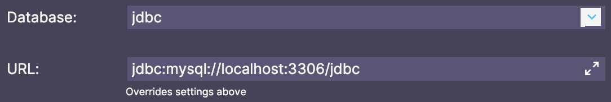
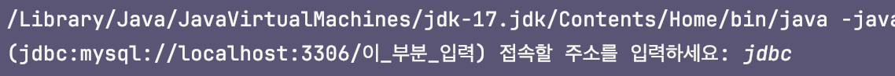
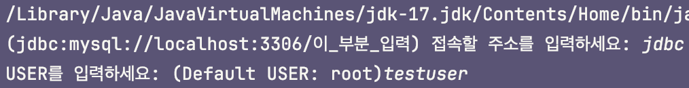
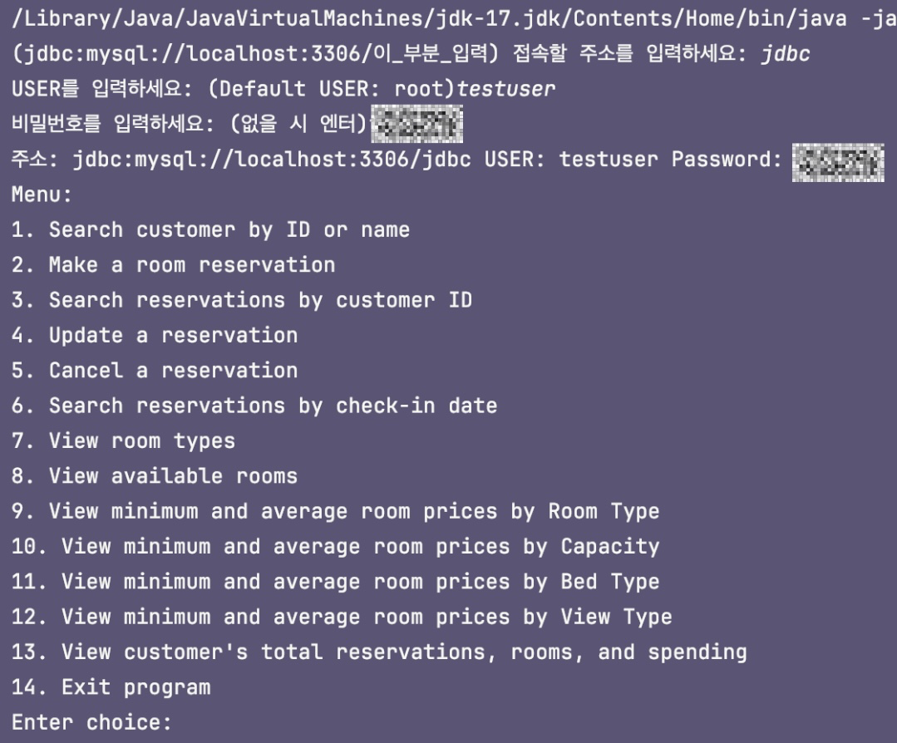

# Hotel Booking System
#### 2024-spring-ewha-database-mini project

This project is a hotel booking java application using JDBC and a MySQL database.
The application will allow users to retrieve, insert, update, and delete data in the database.

 

### Application user interface
- text-based user interface
- results of queries are in text-based table format

 

### How to execute the codes
사용자 컴퓨터 환경에 맞게 접속하는 주소, 아이디, 비번 설정하여 프로그램 실행

**접속 주소 입력**
 데이터베이스 이름을 입력하면 된다.

⌨️ 입력:

**USER 입력**
 사용자 mysql user 아이디를 입력하면 된다.

**비밀번호 입력**
 사용자 mysql 패스워드를 입력하면 된다.

그러면 이렇게 사용자가 번호를 입력하면 동작하는 Menu가 등장한다. Enjoy MSLHotelService!🍀
